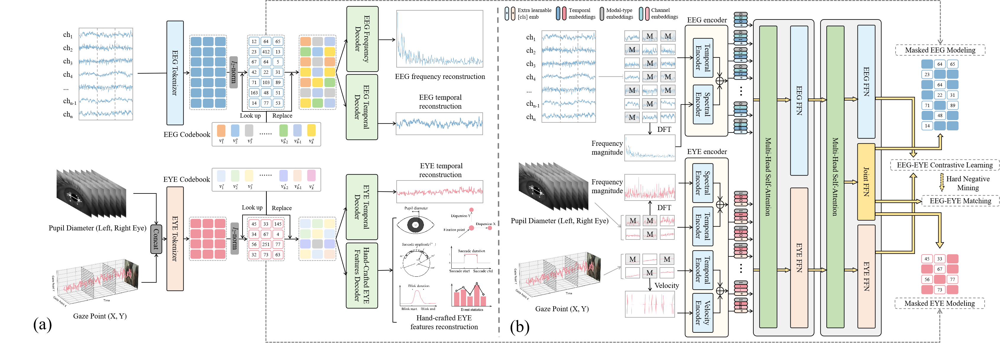

# E2Mo (AAAI 26)
This is the official implementation of our AAAI 26 paper "A Multimodal EEG-Eye Movement Model for Automatic Depression Detection".



# Abstract
Depression is a prevalent mental health disorder characterized by persistent sadness and a diminished interest in daily activities, early detection of depression facilitates timely intervention, mitigating its adverse effects. Electroencephalography (EEG) signals and eye movements are emerging as promising biomarkers for depression detection due to their non-invasive nature and cost-effectiveness. Nevertheless, existing studies suffer from methodological constraints, including low specificity, insufficient sample sizes, limited generalizability, and difficulties in large-scale replication, which collectively undermine their clinical utility. To address these challenges, we collected a large-scale depression dataset comprising EEG and eye movements from 1,060 individuals diagnosed with depression and 1,308 healthy controls. To efficiently leverage multimodal data for automatic depression detection, we propose the EEG-Eye Movements Model E2Mo. E2Mo employs modality-specific encoders to extract discriminative multi-view features from each modality and incorporates a mixture-of-modality-experts architecture with multi pretraining tasks to achieve efficient and robust modality alignment and fusion. Our approach achieves a 70.06% balanced accuracy by leveraging multi-modal data, demonstrating the effectiveness of integrating EEG signals and eye movements for automatic depression detection.


# Usage
## Tokenizer training

### Create conda environment
```
conda env create -f environment.yml
```

### EEG tokenizer training
```
./run_vqkd_EEG.sh
```
### EYE tokenizer training
```
./run_vqkd_EYE.sh
```
## Pretraining
### Pretraining EYE-only
```
./run_pretraining_EEG.sh
```
`--vqkd_pretrained_weight_EEG` should point to the EEG tokenizer training checkpoint path.
### Pretraining EYE-only

```
./run_pretraining_EYE.sh
```
`--vqkd_pretrained_weight_EYE` should point to the EYE tokenizer training checkpoint path.

### Pretraining multimodal
```
./run_pretraining_multi.sh
```
`--vqkd_pretrained_weight_EEG` should point to the EEG tokenizer training checkpoint path.

`--vqkd_pretrained_weight_EYE` should point to the EYE tokenizer training checkpoint path.

`--load_from_pretrain`  should point to the EEG-only pretraining checkpoint path.

## Finetuning
### EEG finetuning
```
./run_finetuning_EEG.sh
```

`--finetune` specifies the checkpoint path for fine-tuning, which should be initialized from the EEG-only pretraining checkpoint path.

### EYE finetuning
```
./run_finetuning_EYE.sh
```
`--finetune` specifies the checkpoint path for fine-tuning, which should be initialized from the EYE-only pretraining checkpoint path.

### multimodal finetuning
```
./run_finetuning_multi.sh
```
`--finetune` specifies the checkpoint path for fine-tuning, which should be initialized from the multimodal pretraining checkpoint path.


# Citation
If you find this code useful, please consider citing our paper:
```
@inproceedings{,
  title={A Multimodal EEG-Eye Movement Model for Automatic Depression Detection},
  author={},
  booktitle={AAAI},
  year={2026}
}
```


